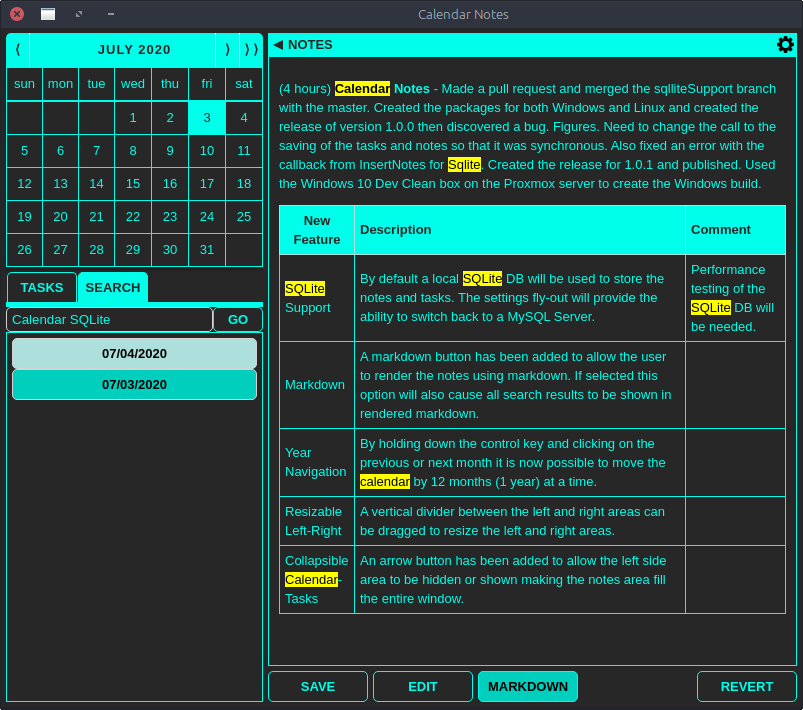

# CalendarNotes
An Electron application for daily notes (or journal) entries saved to a SQLite or MySQL DB and searchable by words.

Current release:
<br/>https://github.com/dhunt84971/CalendarNotes/releases/tag/v1.1.13


This is a port of an application originally written in Gambas.  Much of the code for the calendar component came from a 
javascript tutorial taken from here:
<br/>https://code.tutsplus.com/tutorials/how-to-build-a-beautiful-calendar-widget--net-12538


## Installation
To install the latest release, download the install package appropriate for the platform (exe for Windows, appimage/deb for Linux).
<br/>
https://github.com/dhunt84971/CalendarNotes/releases

### Windows Installation
For Windows simply execute the setup.exe file.

### Linux Installation
There are two options for Linux.  

**App Image Installation**

The appimage is probably the easiest to install, but does not typically result in a menu integrated installation meaning it will be necessary to execute the appimage file to launch the application.  Simply use a file explorer and open the appimage and the application will run.  

**DEB Installation**

The deb file is suitable for all debian based distros include Ubuntu, however there is an additional dependency that is not included in the deb file that needs to be installed manually.  To install the deb file use the following commands from a terminal in the folder where the package was downloaded:

```
sudo apt-get update
sudo apt-get install libappindicator1
sudo dpkg -i calendarNotes_1.0.1_amd64.deb
```
NOTE: Substitute the example deb file name with the version that was downloaded.

This should result in the Calendar Notes application becoming available from the launcher menu.  This will depend on the distro being used.


## Configuration
When the application is first run it will display a warning that no settings file was found.


After clicking OK the application is ready to use with the default settings.  This includes using the default theme and a local SQLite database file.

### MySQL Configuration
The Calendar Notes application can be configured to store all notes and tasks in a MySQL database.  Click on the gear icon in the upper right corner to display the settings and tick the MySQL DB Server radio button.  This will display additional settings for making a connection to a MySQL database.  


Enter the required information and click on **TEST CONNECTION**.  If the connection is successful then provided the user has the correct privileges simply click on the **CREATE TABLES** button.  This will create the necessary tables for storing the notes and tasks.  If a connection is being made to an existing Calendar Notes database that already has the tables, then skip this step.  The main advantage of using a MySQL database is that the notes become accessible from multiple locations.  Just install the Calendar Notes application on any number of computers and configure the MySQL connection.  Now notes can be accessed from anywhere.

### Themes
Several pre-configured themes are available from the application settings.  Examples of each are displayed below:

**Default**


**Warm**


**Cool**


**Green**


**Pink**


**Tron**


**Clu**


### Experimental
The **Experimental** option is for enabling features that are still being tested.

## Features
The main feature of the application is to provide a place to enter and store notes for a particular day on the calendar.  Click on a day in the calendar and the notes for that day are displayed.  Use the **>>** button to navigate directly to today's notes.


### Tasks
The tasks area provides a single location for any active tasks that need to be always displayed.  The tasks are not associated with any particular day and are not archived meaning if changes are made to the tasks area and the **SAVE** button is pressed whatever changes were made to tasks are permanent.  That is why this area is meant for reminders, such as TO DO lists.  Use the Notes area to record when a task has actually been worked on.

### Save and Revert
The **SAVE** button is used to save any changes that are made to the notes or tasks.  To remind the user to press the **SAVE** button astericks (*) are placed on either side of the **SAVE** button to indicate that an edit has been made but not saved.  The only time that edits are automatically saved is when the selected date is changed.  **NOTE: This means unsaved edits will be lost if the application is closed.**

The **REVERT** button is there to remove any unsaved edits.  For example, if the user has inadvertantly mashed on the keyboard and destroyed their notes, clicking on the **REVERT** button will pull the unedited notes from the database and load these back into the notes area.  This also applies to tasks.

### Date Navigation
Date navigation is accomplished by clicking on a date in the calendar.  This will immediately save the current notes and tasks and load the notes for the selected date.  Use the **>>** button to navigate to today and the left and right arrow buttons to move to the previous or next month.  By holding the **Ctrl** key and clicking on an arrow it is possible to move 12 months into the past or future.

### Search
One of the most powerful features of the Calendar Notes application is the simple to use search feature.  To search for a note containing some words click on the **SEARCH** button and enter the words into the text field to the left of the **GO** button then click on the **GO** button to execute the search.  The search uses an inclusive condition for the words being sought meaning that only notes containing ALL of the words will be included in the results.  The results are displayed as buttons below the search entry field.  Each button displays a date where matching words were found.



By hovering over a date in the search results a preview of the note will be displayed in the notes area.  The words being searched for will be highlighted in the previewed notes.  To edit the notes for this day click on the dated button and the calendar will select that date and display the notes.

### Markdown
A markdown renderer has been included to allow the user to enter notes using markdown syntax.  To display the fully rendered markdown click on the **MARKDOWN** button.  It is not possible to edit the notes while markdown rendering is enabled.  To disable the markdown mode click on the **EDIT** button.  The markdown mode applies to the search result previews as well as the currently displayed notes.


### Full Window Notes
In order to keep the application as functional as possible the left side of the application can be hidden so that only the notes editor area is displayed.  To do this click on the left pointing arrow next to the word **NOTES** at the top of the notes editor area.  To restore the left side, click on the right pointing arrow.


## Documents
Currently an experimental feature, enabling documents provides additional functionality allowing the user to create documents and multiple pages for each document.  Use the gear to expose the settings and check the box next to Documents to enable the feature.


### Add a Document
To add a document, click on the **DOCS** button to reveal the documents and then click the **+ ADD DOC** button.


A page will be automatically added for the newly created document.  The new document and new page will have a default name.  Right click on the Document or Page button to display the context menu for the selected item.


Use the document and page context menus to modify the selected item.

#### Document Context Menu
  + **ADD DOC** - Add a document under the selected document.

  + **RENAME** - Rename the selected document.  Documents at the same level cannot have the same name.

  + **REMOVE** - Delete the selected document.  Deleting a document deletes all sub-documents and pages.

  + **MOVE UP** - Move the selected document up in the list.  This does not change the level, only the order.

  + **MOVE DOWN** - Move the selected document down in the list.  This does not change the level, only the order.

#### Page Context Menu
  + **RENAME** - Rename the selected page.  Pages within the same document cannot have the same name.

  + **REMOVE** - Delete the selected page.

  + **INCREASE INDENT** - Indent the page button to the right.  This is just a visual means of establishing a relationship between pages in the same document.

  + **DECREASE INDENT** - Remove indent from the page button.  This moves the button to the left by one indent level per click.

  + **MOVE UP** - Move the selected page up in the list.

  + **MOVE DOWN** - Move the selected page down in the list.

### Drag and Drop
Documents and pages can be moved by dragging and dropping.  Dragging a document will move all sub-documents under that document.  Pages can be dragged from one document to another. 

## Development Setup
VS Code is the recommended IDE.  Install VS Code using the instructions from the VS Code website.  Install nodejs and npm:

For Debian based Linux systems run:
```
sudo apt-get update
sudo apt-get install nodejs npm
```

### Development SQLite Dependencies
To setup a session for development it may be necessary to install python and make sure it is in the path.  This is because if a SQLite binary cannot be found for the installed version of Electron it will need to be built from source and the source includes python code.

For Debian based Linux systems run:
```
sudo apt-get update
sudo apt-get install python
```
